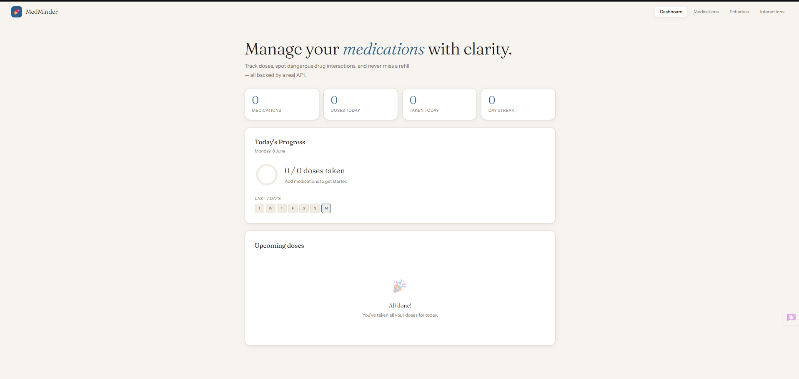
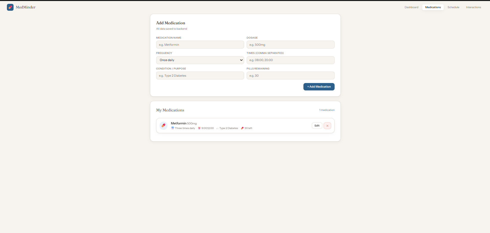
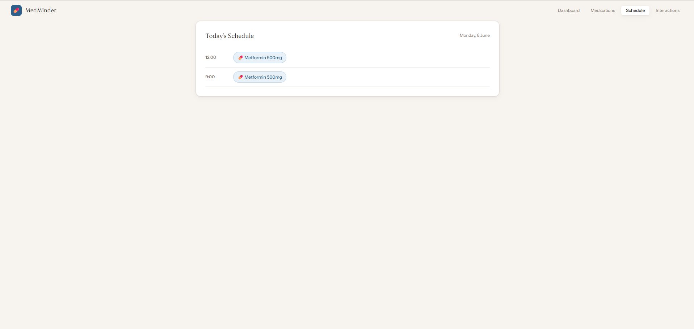
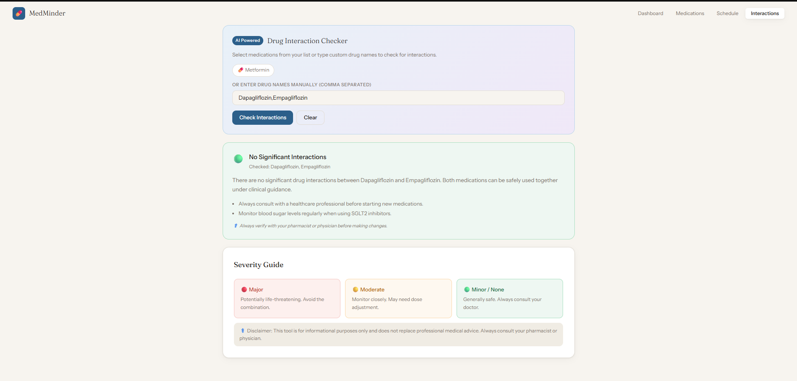

# 💊 MedMinder

> A full-stack medication management web app that helps patients track daily doses, get refill reminders, and check dangerous drug interactions using AI.

[](https://medminder-inky.vercel.app/)


---

## 🎬 Demo


---

## 📸 Screenshots

### Dashboard — Daily progress & streak tracker


### Medications — Add, edit & manage your medications


### Schedule — Timeline view of your day


### AI Interaction Checker — Powered by GPT-4o-mini


---

## 🚑 The Problem

Over **125,000 deaths** occur annually in the US alone due to medication non-adherence. Patients managing multiple medications struggle with:

- Forgetting doses or accidentally double-dosing
- Not knowing dangerous drug-drug interactions
- Missing refill deadlines
- No simple tool that does all of this in one place

**MedMinder solves this.**

---

## ✨ Features

| Feature | Description |
|---|---|
| 💊 Medication Management | Add, edit, delete medications with dose, frequency and schedule |
| ✅ Dose Tracking | Mark doses as taken, progress ring updates in real time |
| 🗓️ Daily Schedule | Timeline view organised by time of day |
| 🤖 AI Interaction Checker | Detects major, moderate and minor drug interactions using AI |
| ⚠️ Refill Reminders | Alerts when pill count drops to 7 or below |
| 🔥 Streak Tracker | 7-day adherence calendar to build healthy habits |
| 💾 Persistent Storage | All data saved to PostgreSQL — never lost on refresh |

---

## 🛠️ Tech Stack

### Frontend
- **React 18** — component-based UI
- **Vite** — fast dev server and build tool
- **Vanilla CSS** — custom design system, no UI library

### Backend
- **FastAPI** — high-performance Python API framework
- **PostgreSQL** — production-grade relational database (hosted on Neon)
- **psycopg2** — PostgreSQL adapter for Python
- **python-dotenv** — environment variable management

### AI
- **OpenRouter API** — routes to GPT-4o-mini for drug interaction analysis

### Deployment
- **Docker** — containerised local development
- **Vercel** — frontend hosting with CI/CD
- **Render** — backend hosting with auto-deploy from GitHub
- **Neon** — serverless PostgreSQL database

---

## 📁 Project Structure

```
medminder/
├── backend/
│   ├── app/
│   │   ├── main.py              # FastAPI app + CORS
│   │   ├── database.py          # PostgreSQL connection + table init
│   │   ├── models.py            # Pydantic schemas
│   │   └── routes/
│   │       ├── medications.py   # CRUD endpoints
│   │       ├── doses.py         # Dose toggle + streak
│   │       └── interactions.py  # AI interaction checker
│   ├── requirements.txt
│   └── Dockerfile
├── frontend/
│   ├── src/
│   │   ├── components/
│   │   │   ├── Dashboard.jsx
│   │   │   ├── Medications.jsx
│   │   │   ├── Schedule.jsx
│   │   │   ├── Interactions.jsx
│   │   │   ├── Navbar.jsx
│   │   │   └── UI.jsx
│   │   ├── hooks/
│   │   │   └── useToast.js
│   │   ├── api.js               # All backend fetch calls
│   │   └── App.jsx
│   ├── Dockerfile
│   └── package.json
├── assets/                      # Screenshots for README
├── docker-compose.yml
└── README.md
```

---

## 🚀 Run Locally

### Option A — Docker (Recommended, one command)

**Prerequisites:** Install [Docker Desktop](https://www.docker.com/products/docker-desktop)

**1. Clone the repo**
```bash
git clone https://github.com/mohith292005/medminder.git
cd medminder
```

**2. Create `backend/.env`**
```
DATABASE_URL=postgresql://your-neon-url-here
OPENROUTER_API_KEY=your-openrouter-key-here
FRONTEND_URL=http://localhost:5173
```

**3. Start everything**
```bash
docker-compose up --build
```

- App → http://localhost:5173
- API → http://localhost:8000
- API Docs → http://localhost:8000/docs

**Stop:**
```bash
docker-compose down
```

---

### Option B — Manual (two terminals)

**Prerequisites:** Python 3.11+, Node.js 18+

**Terminal 1 — Backend**
```bash
cd backend
pip install -r requirements.txt
uvicorn app.main:app --reload
```

**Terminal 2 — Frontend**
```bash
cd frontend
npm install
npm run dev
```

---

## 🌐 API Endpoints

| Method | Endpoint | Description |
|--------|----------|-------------|
| GET | `/api/medications/` | List all medications |
| POST | `/api/medications/` | Add a medication |
| PUT | `/api/medications/{id}` | Update a medication |
| DELETE | `/api/medications/{id}` | Delete a medication |
| GET | `/api/doses/{date}` | Get doses for a date |
| POST | `/api/doses/toggle` | Toggle dose taken/untaken |
| GET | `/api/doses/streak/last7` | Get last 7 days streak |
| POST | `/api/interactions/check` | AI drug interaction check |

Full interactive docs at → http://localhost:8000/docs

---

## ☁️ Deployment

| Service | Purpose | URL |
|---|---|---|
| Vercel | Frontend | https://medminder-inky.vercel.app/ |
| Render | Backend API | https://medminder-u38p.onrender.com |
| Neon | PostgreSQL DB | neon.tech |

---

## ⚕️ Disclaimer

MedMinder is a portfolio project built for educational purposes. It is not a substitute for professional medical advice. Always consult your pharmacist or physician before making changes to your medication regimen.

---

## 👨‍💻 Author

**Mohith** — Final Year CS Student
[GitHub](https://github.com/mohith292005) 